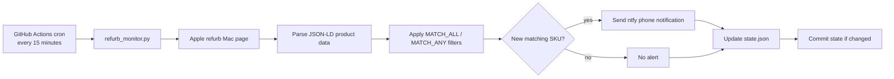

# Apple Refurb Monitor

Python + GitHub Actions monitor for Apple refurbished Mac inventory. It checks Apple's refurb store every 15 minutes and sends a phone push through [ntfy.sh](https://ntfy.sh) when a listing matches the configured filter.

Built for monitoring **Mac mini M4 Pro 48GB**, with filters controlled by GitHub Actions variables.

## What This Demonstrates

- Scheduled automation with GitHub Actions
- Secret handling with repository Actions secrets
- Stateful alert deduping with `state.json`
- Parser health checks for failure detection
- Dependency-free Python using only the standard library
- Practical notification workflow without a paid backend

## Architecture



## How It Works

- `refurb_monitor.py` fetches `https://www.apple.com/shop/refurbished/mac/mac-mini`.
- It parses the JSON-LD product blocks Apple embeds for SEO.
- It combines each product's title and description into a searchable string.
- `MATCH_ALL` terms must all appear. `MATCH_ANY` terms are optional, but if set, at least one must appear.
- A SKU is only added to `seen_skus` after the ntfy notification succeeds, so failed notifications retry on the next run.
- SKUs that disappear are removed from the seen set, so a future relisting triggers a fresh alert.

## Failure Checks

The monitor has two deadman checks:

- **Count deadman:** alerts when total parsed listings fall below `MIN_LISTINGS` default `50`.
- **Health deadman:** alerts when fewer than 50% of listings contain `ssd`, a useful signal that Apple may have changed the data shape.

Both alerts are sticky. You get one warning per outage, not one warning every 15 minutes.

## Configuration

Set `NTFY_TOPIC` as a GitHub Actions repository secret.

Optional GitHub Actions repository variables:

| Variable | Purpose | Default |
| --- | --- | --- |
| `MATCH_ALL` | Comma-separated terms that must all match | `mac mini,m4 pro,48gb` |
| `MATCH_ANY` | Optional comma-separated terms where at least one must match | empty |
| `MIN_LISTINGS` | Minimum healthy listing count before the count deadman fires | `50` |

## Local Status Check

```bash
python3 refurb_monitor.py --status
```

This prints the current listing count, active filters, parser health, and matching SKUs. A non-zero listing count with zero matches means the parser is working and Apple simply does not have the target configuration listed.

## Local Notification Test

```bash
NTFY_TOPIC=your-topic MATCH_ALL="mac mini" python3 refurb_monitor.py
```

Use this only with a real ntfy topic. The script sends a notification for any new matching SKU and updates `state.json` only after the send succeeds.

## Operational Notes

- GitHub scheduled workflows can lag under load, so this is near-real-time, not second-by-second monitoring.
- Public repositories can have scheduled workflows disabled after long inactivity. Keep an eye on the Actions tab if the project sits untouched.
- ntfy's free public topics are private only by obscurity. Use a hard-to-guess topic and do not put it in code or logs.
- If `--status` reports zero listings, Apple likely changed its page structure or blocked the fetch.

## Files

- `refurb_monitor.py` - parser, matcher, notifier, and state handling
- `.github/workflows/monitor.yml` - schedule, environment wiring, and state commit
- `state.json` - tracked SKUs and deadman alert flags
- `.gitignore` - local Python cache ignores

## License

MIT. See [LICENSE](LICENSE).
